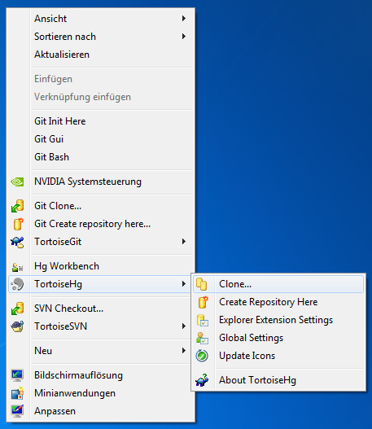
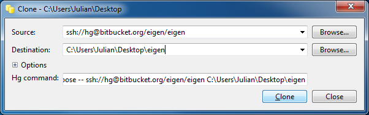
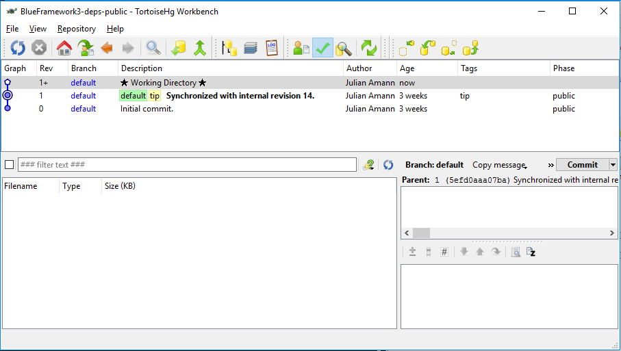

# Building

## Prerequisites for Windows

### Get the source code

Checkout the source from Bitbucket (https://bitbucket.org/tumcms/blueframework) using the Mercurial Hg version control system. Mercurial is a distributed source control management tool. It can be downloaded from http://mercurial.selenic.com/. After installing you can clona a repository. For instance, to clone the Eigen repository (https://bitbucket.org/eigen/eigen) you can type `hg clone ssh://hg@bitbucket.org/eigen/eigen `into a console window or you can use the graphical user interface:



Now you can specify a source and a destination.



After pressing the ```Clone``` button the repository is cloned to the destination folder. Procede in the same way with the BlueFramework repository.

To check out the source code of the BlueFramwork proced as describe in the following instructions:

1. Install mercurial from http://mercurial.selenic.com/. It comes with TortoiseHg on Windows:

2. Now clone the code by typing `hg clone https://bitbucket.org/tumcms/blueframework`

### Third-party dependencies

Install the following third-party libraries:

**Windows 10 SDK** (https://developer.microsoft.com/en-us/windows/downloads/windows-10-sdk)

**Boost: 1.65.1**: Download a prebuild version from https://sourceforge.net/projects/boost/files/boost-binaries/1.65.1/ or build it yourself. 
Not all parts of boost are required. You just need: filesystem, python, signals and system.

Building Boost can take some time and consumes a lot of disk space. To build it faster with less memory wastage you can build only the parts of boost that are needed. Use this command:
`C:\thirdparty\vs2017\x64\boost_1_65_1>b2 address-model=64 toolset=msvc-14.1 --build-type=complete stage --with-filesystem --with-signals --with-system --with-date_time --with-regex`

The percdems repository (https://bitbucket.org/Vertexwahn/percdems) contains some build scripts to build librareis such as Boost.

**Qt 5.10.0** from https://www.qt.io/

## How to build BlueFramework with CMake Step by Step

BlueFramework version 3.0.0.0 and up compiles with Visual Studio 2017 x64 (Version 15.4.4). Currently, we are not aiming at supporting any other compilers.

