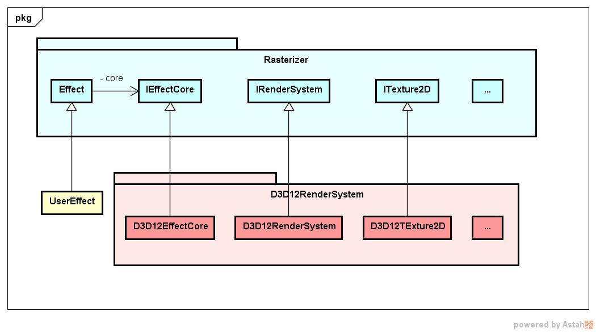

# Rasterizer

## Clear Screen

## Precompile Shader
To precompile d3d11 shader run **Tools/precompileEffectFiles.py \<dir\>** where \<dir\> 
is the directory of the blueframework effect files (.be). The script will generate .cso files 
for every shader specified in the effect files. Those will then be used by the D3D11RenderSystem 
instead of compiling the shaders from source.