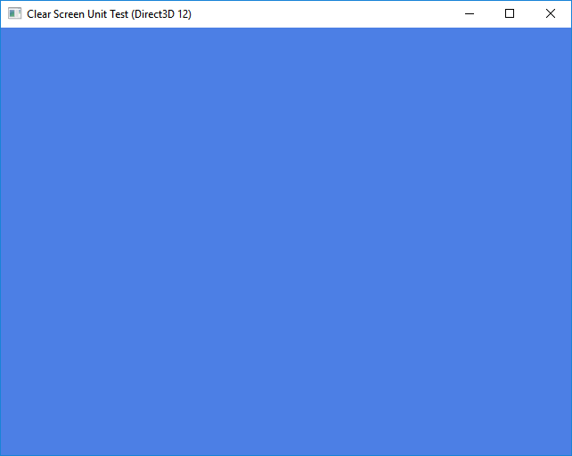
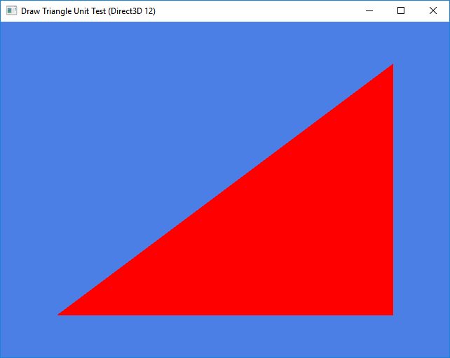
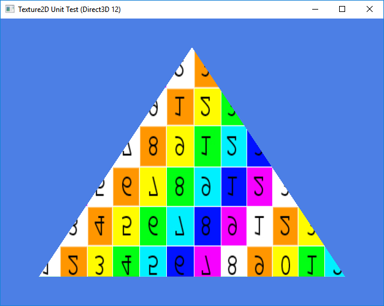
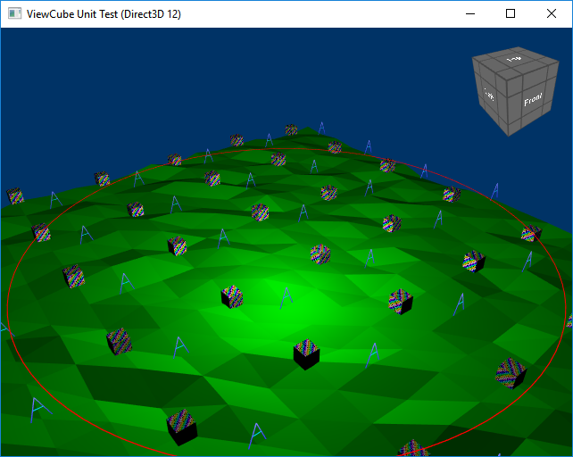

# Unit Tests

Here you can see some unit test of the Rasterizer/Engine module. Besides this, we have also non-graphically unit test.

If you are interested in graphically based unit test please take also a look at the paper [Using Image Quality Assessment to Test Rendering
Algorithms](http://wscg.zcu.cz/wscg2013/program/full/E43-full.pdf) 

## Clear Screen

## Draw Triangle

## Texture 2D

## View Cube

