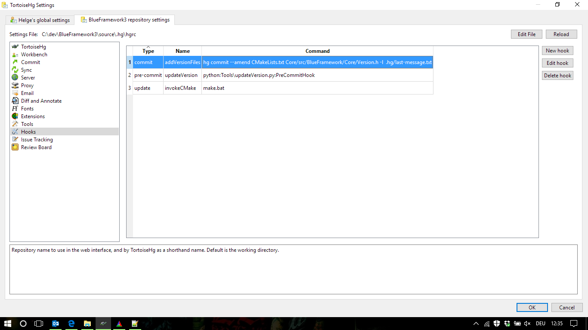

# Versioning

Automatic version is achieved by exploiting Mercurials hook mechanism. Simply copy the following code lines into your hgrc file located in the ".hg" folder.

```ruby
[hooks]
commit.addVersionFiles = hg commit --amend CMake/ProjectVersion.cmake Core/src/BlueFramework/Core/Version.h -l  .hg/last-message.txt
pre-commit.updateVersion = python:Tools\updateVersion.py:PreCommitHook
```

